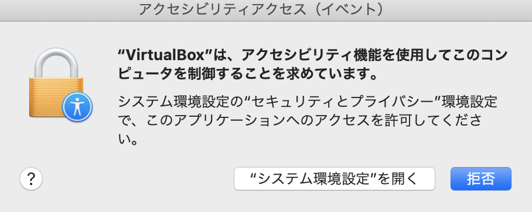
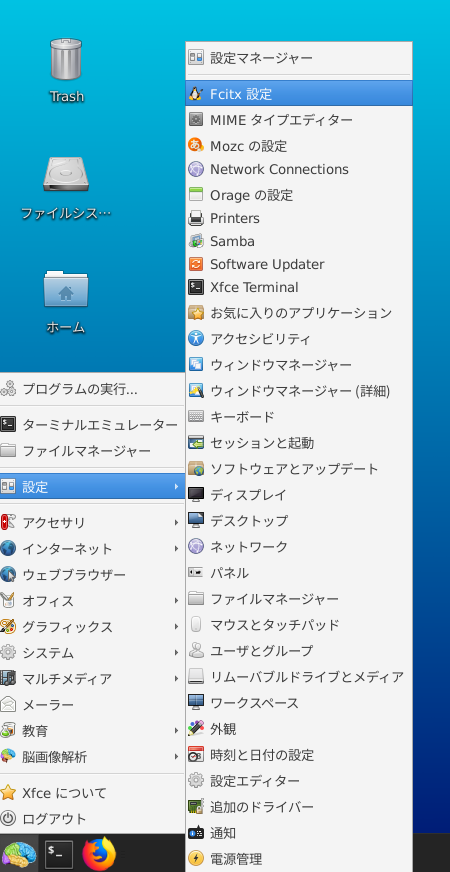

# 生理学研究所トレーニングコース用準備ページ

ここは、2024年7-8月に開催予定である **『生理学研究所トレーニングコース』** の受講者を対象とした情報提供サイトです。新しい情報があれば、随時このサイトへ追加していきますので、定期的にアクセスするようにして下さい

## パソコンの準備について

- トレーニングコースでは、受講者にご自身でPCを準備して頂き、実際に操作しながら学んでいきます。PCのスペックについては、以下の **推奨条件** を参考にして下さい

    - OS: Windows10,11 64bit版 または macOS 10.15（Catalina）以降
    - CPU: Intel Core i7/i9、Intel Core i5（クロック周波数2.0GHz以上）、または AMD Ryzen 5以上の性能を有するもの **注意: 現在、Apple M1/M2/M3はVirtualBoxで仮想マシンを動作できないため、Lin4Neuroは動作できません。以下をご覧ください**
    - メモリ：8GB以上 (可能ならば16GB以上を推奨します)
    - ハードディスク：100GB以上の空き容量 (外付けハードディスクも可)
    - 2ボタン以上のUSBマウス (必須ではありませんが、持っていると便利です)

- Lin4Neuroでの受講を推奨しますが、macOS native 環境で受講したい方々のために、インストラクションを準備しました。[こちら](macOS_native.md){:target="_blank"} をご確認ください

- Zoomは画面共有でメモリを相当消費します。そのため、Zoomで受講するための別のPCもしくはタブレットをご準備ください。解析用のPCとZoom用のPCは別々で全く支障ありません

    
## 事前準備

- **準備には、約3-4時間必要となります。時間に十分に余裕をもって準備をされてください。**

    A. トレーニングコース用Lin4Neuro仮想アプライアンスのダウンロード (1-2時間)

    B. VirtualBoxのインストール (10分)

    C. VirtualBoxへのLin4Neuroのインポート (15分)

    D. 共有フォルダの設定 (5分)

    E. Lin4Neuroの起動と設定 (10分)

    参考. 仮想マシンの削除 (トレーニングコース後、不要になった場合)


### A. トレーニングコース用Lin4Neuro仮想アプライアンスのダウンロード (所要時間約1-2時間)

- 以下からLin4Neuroをダウンロードしてください。13GBありますのでダウンロードには約1-2時間かかります。

    - [L4N-2204-NIPS-20240423.ovaのダウンロード](https://www.nemotos.net/l4n-nips/L4N-2204-NIPS-20240423.ova){:target="_blank"} 

### B. VirtualBox 7.0以降 のインストール (所要時間約10分)

トレーニングコースでは、**<span style="color: red; ">VirtualBox 7.0.16以降</span>**の上で Lin4Neuro を動作させます。Lin4Neuro は、VirtualBox 7.0.16で構築されているため、前のバージョンのVirtualBoxを使用の方は**必ず7.0.16以降にアップグレードしてください。**特にmacOS(Intel)は、以前のバージョンでは仮想マシンが立ち上がらない不具合がありますのでご注意ください。なお、アップグレードする際は、一度、VirtualBoxを終了させないとエラーとなりますのでご注意ください。なお、macOSの方は Homebrew 経由でインストールした方がエラーが起こりにくいことを経験しています。

#### Windows

- [VirtualBoxのサイト](https://www.virtualbox.org/wiki/Downloads){:target="_blank"} から、ご自身のOSにあった最新のVirtualBoxのインストーラーをダウンロードします(2024年7月10日現在の最新のバージョンは7.0.18です。こちらをダウンロードしてください)

- ダウンロードしたインストーラーを用いてVirtualBox 7.0 をインストールします

- インストール後、VirtualBoxを起動します

    

#### macOS

- Homebrew経由でインストールします。まだ Homebrew をインストールしていない方は以下でインストールできます

```
/bin/bash -c "$(curl -fsSL https://raw.githubusercontent.com/Homebrew/install/HEAD/install.sh)"
```

- 次に、以下のコマンドでインストールできます

```
brew install virtualbox --cask
```


### C. Lin4Neuro仮想アプライアンスのインポート (所要時間約15分)

- (Windowsで、ディスプレイが推奨サイズ(150%)だと、「次へ」や「インポート」などの画面下部が隠れてしまうことがあります。
その際は、Windowsの設定で推奨サイズを100%にしたり、ファイルを指定した後にEnterを押すなどすれば対応できます)

- ダウンロードした仮想アプライアンス (L4N-2204-NIPS-20240423.ova) を用いて仮想マシンをインポートします

- VirtualBoxのメニューから **ファイル** → **仮想アプライアンスのインポート** を選択します

    

- ファイルに、ダウンロードした **L4N-2204-NIPS-20240423.ova** を指定し、 **<kbd>次へ</kbd>** をクリックします

    

- 設定画面が出ます。ひとつだけ気をつけていただきたいのが、 **Machine Base Folder** です。このフォルダの下に仮想マシンがインストールされます。必ず、**<span style="color: red; ">100GB以上あいているところを指定してください</span>**(容量が十分にある場合は、デフォルトのままでかまいません)。外部ハードディスクを指定することもできます。SDカードは、速度が異常に遅く実用性に耐えられませんので、使わないでください

- 設定を確認したうえで、 **インポート** をクリックしてください
- インポートには10−15分程度かかります。辛抱強くお待ちください

    

- インポートが終了すると、VirtualBoxのメイン画面に、 **L4N-2204-NIPS** が表示されます

    

### D. 共有フォルダの設定 (所要時間約5分)

- 30GB以上あいているところに、Macの方はFinderから、Windowsの方はエクスプローラーから、 **share** というフォルダを作成します。すべて小文字で作成してください

- あとで確認するため、作成した share フォルダに、何か適当なファイルを入れておいてください

- **Lin4Neuroが起動していない状況で**、VirtualBoxのメイン画面で、L4N-2004-NIPSをクリックし、選択してから、 **設定** をクリックします

    

- 設定画面の左側のペインで **共有フォルダー** をクリックしたうえで、画面右側の共有フォルダを追加するアイコンをクリックします

    

- **フォルダーのパス** の右側の▼から、**その他...** を選択し、先程作成した **share** フォルダを選択します

- フォルダー名が **share** になっていることを確認します

- **読み込み専用** と **自動マウント** は**チェックが入っていない**ことを確認してください

- このうえで、 **<kbd>OK</kbd>** をクリックします

    


### E. Lin4Neuroの起動と設定 (所要時間約10分)

- VirtualBoxのメイン画面から、 **L4N-2204-NIPS** を選択したうえで、 **起動** をクリックします

    

    - macOSの場合、数のように「"VirtualBox"は、アクセシビリティ機能を使用してこのコンピュータを制御することを求めています。」といった表示が出ることがあります。その場合は、素直にシステム環境設定を開いて、VirtualBoxにアクセスを許可してください。

    

    - macOSの場合、「マイクにアクセスすることを許可します」と出た場合、<kbd>OK</kbd> をクリックして許可してください。そうしないと起動しません

- 下図のような画面になります。Enter/return を押すかそのまま待てば自動で起動します

    

- ログイン画面が立ち上がります。パスワードは **lin4neuro** です。すべて小文字です

    


#### 1. 画面のフォント設定

- VirtualBoxのメニューから "表示" -> "仮想スクリーン" -> "XX%にスケール" を選択してください。適宜見やすい大きさに調整してください

    

#### 2. 共有フォルダの確認

- 画面左上にある **sf_share** は共有フォルダとして設定したものです

- sf_share をダブルクリックし、先程試しに入れたファイルが見えることを確認してください

#### 3. 画像解析ツールの確認

- ログインした後、左下の脳のアイコンをクリックし、 **脳画像解析** をクリックすると、インストールされているソフトウェアを確認できます

    

## Lin4Neuroの終了

- Lin4Neuroを終了するには、左下の脳のアイコンをしたスタートメニューから ログアウト → シャットダウン を選択します


## トラブルシューティング

- これまでに問い合わせをいただいた内容とその対策を紹介します

- 【質問】macOSにVirtualBoxをインストールし、Lin4Neuroをインポートし、実行しようとしたところ、以下のエラーメッセージが出て起動しません。

```
The virtual machine 'L4N-2004-abis' has terminated unexpectedly during startup with exit code 1 (0x1).

終了コード : NS_ERROR_FAILURE (0x80004005)
コンポーネント: MachineWrap
インターフェース: IMachine {85632c68-b5bb-4316-a900-5eb28d3413df}

Kernel driver not installed (rc=-1908)

Make sure the kernel module has been loaded successfully.

where: suplibOsInit what: 3 VERR_VM_DRIVER_NOT_INSTALLED (-1908) - The support driver is not installed. On linux, open returned ENOENT. 

```

- 【回答】これは、比較的有名な症状です。rc=-1908 問題と私は勝手に読んでいます。以下を実行してください。https://www.nemotos.net/?p=3707 も参考にしてください。
    - 一度、VirtualBoxをアンインストールしてください。
    - macOSを再起動してください。
    - VirtualBoxをインストールする際に、ダイアログがでる度に、システム環境設定 -> セキュリティを確認してください。
    - "Oracle" のキーワードを見ながら、都度許可を出してください。
    - これでインストールできる可能性が高いです。
    - なお、SIPを無効にする方法は最近はうまくいかないです…


- 【質問】「D. 仮想マシンの設定 (所要時間約5分)」の作業中、VirtualBoxのメイン画面から設定タブを押すと設定画面の下部に「無効な設定が見つかりました。」と表示され、共有フォルダなどの設定が出来ませんでした。設定をしない状態で起動を押しても、「仮想マシン"L4N-2204-NIPS"のセッションを開けませんでした。」という警告が出てしまいます。

    - 【回答】これは、主にHPのPCで、仮想化が有効にされていないことによります。以下の方法で解決できます

        - 一度インポートしたLin4Neuroの仮想マシンを削除してください。abis-webのページの最後のセクションを参考にしていただけたらと思います。ダウンロードしてできている .ova ファイルはまだ削除しないでください。

        - HPのBIOS設定からVT-xを有効にします。[HPの公式サイト](https://support.hp.com/jp-ja/document/c04773368) に記載がありますので、こちらを参考にしてください。

        - 再起動し、VirtualBoxに再度仮想アプライアンス（L4N-2004-abis-20211110.ova）をインポートします。

- 【質問】「C. Lin4Neuro仮想アプライアンスのインポート」の説明の通りに，ファイル → 仮想アプライアンスのインポート→ ダウンロードした「L4N-2204-NIPS-20240423.ova 」を指定→Machine Base Folder はデフォルトのまま→インポート，と一連の作業をしてみましたが，「仮想アプライアンスに失敗しました」とエラーが表示されました。ストレージは残り約600GB利用可能です。詳細のボタンをクリックすると「終了コード：NS_ERROR_INVALID_ARG (0x80070057)」と表示されます。

    - 【回答1】これは、Machine Base Folderに同じファイルがなんらかの理由で存在する時に起きる症状です。[こちらのページ](http://www.is.chs.nihon-u.ac.jp/students/file/import_E_INVALIDARG.pdf)に解決法が記載されています

        - 仮想メディアマネージャーを確認し、L4N-2204-NIPS-20240423.vdi などがないか確認します。あったら削除してください

        - VirtualBox VMs のフォルダに L4N-2204-NIPS というフォルダがないかどうかを確認してください。あったらそれを削除してください

        - 再起動したうえで、再度インポートするとインポートできます

    - 【回答2】 もうひとつの可能性は、ダウンロードしたovaファイルが壊れていることによります。再ダウンロードをしていただけたらと思います
    
- 【質問】英語キーボードを使っています。どうすればいいですか。

    - 【回答】配布しているLin4Neuroの仮想マシンは日本語キーボードで設定されています。英語キーボードにするには、以下の作業を行ってください

        - メニューから "設定" -> "Fcitx設定" を選択します

            

        - 画面下の矢印を使って、"キーボード - 英語(US)" が一番来るようにして、ウィンドウを閉じます

            


----

## 参考. 仮想マシンの削除 (トレーニングコース後、不要になった場合)

1. 仮想マシンを削除するには、VirtualBoxのメイン画面で、削除したい仮想マシンを選び、右クリックをして、**除去(R)...** を選択します

    

2. 次にあらわれる画面で、**すべてのファイルを削除** を選択します

    


